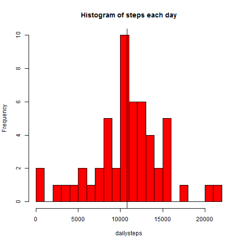
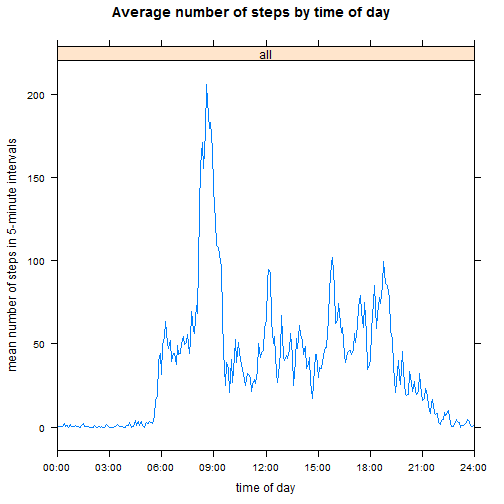
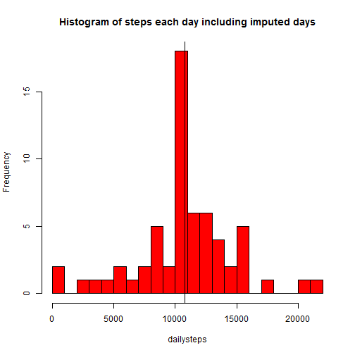
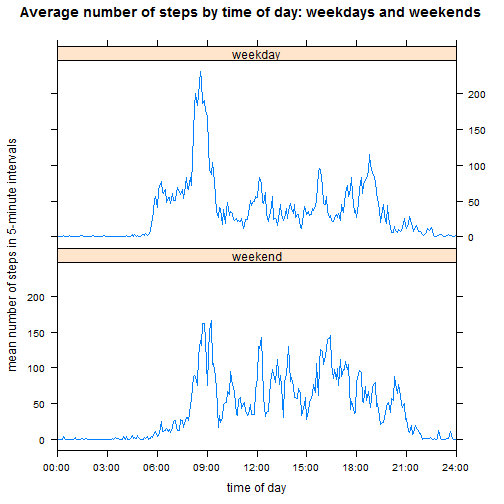

# Reproducible Research: Peer Assessment 1


## Loading and preprocessing the data

The data is provived in a zipped file containing `activity data`. 
It has 17568 observations of five-minute intervals, though some are incomplete.

There are 12 five-minute intervals in an hour and so in a 24-hour day there are
12*24=288 five-minute intervals.  
The activity set covers 61 days: note that 61*288=17568.


```r
# Initial setup
setwd("C:/Users/HB/RepData_PeerAssessment1")  # need correct working directory
library(lattice)  # package used later

# Read activity data from zip file
activity <- read.csv(unz("./activity.zip", "activity.csv"), header = TRUE, stringsAsFactors = FALSE)
date()  # today's download date
```

```
## [1] "Sat May 10 20:00:14 2014"
```

```r
dim(activity)  # data rows and columns  
```

```
## [1] 17568     3
```

```r
length(unique(activity$date))  # number of different dates
```

```
## [1] 61
```

```r
length(unique(activity$date)) * 24 * (60/5)  # 5-minute intervals those days
```

```
## [1] 17568
```


Each observation states which date it occured and indicates which five-minute 
interval it occurs in, though the format of each of these can be adjusted 
to a more usable format. 
It will also be useful to know later whether particular days 
are weekdays or weekends. 


```r
# Treat dates as proper dates,
activity$date <- as.Date(activity$date, format = "%Y-%m-%d")
# Identify as weekend or weekday
activity$weekdayend <- factor(ifelse(weekdays(activity$date) %in% c("Saturday", 
    "Sunday"), "weekend", "weekday"))

# functions to change interval to hours of day so 1000 (10am) becomes 10 and
# thirty minutes ealier 930 (09:55) becomes 9.5
minutesfrominterval <- function(interval) {
    60 * floor(interval/100) + interval - 100 * floor(interval/100)
}
hoursfrominterval <- function(interval) {
    minutesfrominterval(interval)/60
}
```


15264 of the observations are complete, recording the number of steps. 
This involves 53 different days. Note that 15264=53*288. 


```r
# look only at cases where data complete
activitycomplete <- activity[complete.cases(activity), ]
dim(activitycomplete)
```

```
## [1] 15264     4
```

```r
length(unique(activitycomplete$date))  # number different days with complete data
```

```
## [1] 53
```

```r
length(unique(activitycomplete$date)) * 24 * (60/5)  # 5-minute intervals those days
```

```
## [1] 15264
```


## What is mean total number of steps taken per day?

The mean number of steps taken each day in complete cases was just over 10766 
(the median is close at 10765), though the range is wide: the 
lowest number was just 41, while the largest was 21194. 
The histogram shows the most frequent bar between 10000 and 11000. 


```r
# calculate sum of steps per day, calculate mean and median, show histogram
dailysteps <- tapply(activitycomplete$steps, activitycomplete$date, "sum")  #steps per day

mean(dailysteps)  # mean   of steps each day
```

```
## [1] 10766
```

```r
median(dailysteps)  # median of steps each day
```

```
## [1] 10765
```

```r
c(min(dailysteps), max(dailysteps))  # range  of steps each day
```

```
## [1]    41 21194
```

```r
hist(dailysteps, col = "red", main = "Histogram of steps each day", breaks = 20)
abline(v = mean(dailysteps))  # show mean on histogram
```

 


## What is the average daily activity pattern?

Mean numbers of steps are almost zero until shortly before 06:00, presumably 
reflecting sleeping hours followed by waking-up.  
They reach a peak in the interval at 08:35, 
possibly indicating a habitual time for travelling to work each morning, 
though there is no corresponding evening peak, 
which might suggest a greater variety in returning home or a different means 
of travel.  From about 19:00 onwards, the mean number of steps gradually returns 
towards zero again, suggesting going to sleep, though not necessaryily at the 
same time each evening 


```r
#calculate and plot mean number of steps for each of five-minute intervals 
#             across the days where there is information  

#function to calculate mean for different times of day (also used later)
av5minsteps <- function(activitydf, checkdayend="all"){
  if(checkdayend != "all"){activitydf <-
                           activitydf[activitydf$weekdayend==checkdayend,] }
  mean5minsteps <- tapply(activitydf$steps, #caculate means 
                          activitydf$interval, "mean")
  interval=as.numeric(names(mean5minsteps))
  data.frame(interval, 
             hours=hoursfrominterval(interval), 
             mean5minsteps, weekdayend=checkdayend)    #return dataframe
}
av5mincomplete <- av5minsteps(activitycomplete)        #use the function

#produce latticeplot of mean steps by time of day
with(av5mincomplete,                             #dataframe to use   
     xyplot(mean5minsteps ~ hoursfrominterval(interval)|weekdayend, 
            type="l",                            #line not dots 
            xlab="time of day", 
            ylab="mean number of steps in 5-minute intervals",
            xlim=c(0,24),
            scales=list(x=list(at=seq(0,24,3), #tick marks every 3 hours
                               labels=c("00:00","03:00","06:00","09:00","12:00",
                                        "15:00","18:00","21:00","24:00") ) ),
            main="Average number of steps by time of day" ) )
```

 

```r
#find peak interval for number of steps
av5mincomplete$interval[which(av5mincomplete$mean5minsteps == 
                        max(av5mincomplete$mean5minsteps))] 
```

```
## [1] 835
```


## Imputing missing values

We already know that 61-53=8 days have missing values. 
One approach to imputing values for the intervals in these days is to take the 
means for each five-minute interval just calculated and apply these to the 
missing days.  Since numbers of steps are integers, a slight adjustment 
to round the means for each interval to an integer might be sensible.


```r
# impute missing numbers of steps
activityrevised <- merge(activity, av5mincomplete[, c("interval", "mean5minsteps")], 
    by = "interval")
activityrevised[is.na(activityrevised$steps), "steps"] <- round(activityrevised[is.na(activityrevised$steps), 
    "mean5minsteps"], 0)
```


This changes the calculated mean and the median number of steps per day by a very small amount to 10766 and 10762 respectively.  The tiny change should not be a suprise: we have imputed 8 days which  each have a number of total number of steps (10762) very close to the daily mean and median.  The change in the histogram is more obvious as the central peak rises as an artifact of including the 8 imputed days, all with the dame number of steps.    


```r
# calculate sum of steps per day, calculate mean and median, show histogram
dailysteps <- tapply(activityrevised$steps, activityrevised$date, "sum")  #steps per day
mean(dailysteps)
```

```
## [1] 10766
```

```r
median(dailysteps)
```

```
## [1] 10762
```

```r
hist(dailysteps, col = "red", main = "Histogram of steps each day including imputed days", 
    breaks = 20)
abline(v = mean(dailysteps))  # show mean on histogram
```

 

```r

sum(av5mincomplete$mean5minsteps)  #Another way of calculating mean before imputation
```

```
## [1] 10766
```

```r
sum(round(av5mincomplete$mean5minsteps))  #Daily steps for imputed days - note rounding
```

```
## [1] 10762
```


## Are there differences in activity patterns between weekdays and weekends?

Since the mean pattern of steps through the day appears at first sight to be work related, especially around 09:00, it is worth considering whether the pattern varies between weekdays and weekends. 

In fact there is and it is visible in the graphs: at weekends, waking-up seem more often to be broadly around 08:00 than a precise time just before 06:00, the steps peaking at around 09:00 is no longer there, more steps are taken in the afternoon at the weekend, and there is a slight suggestion of a later bedtime, often perhaps about 21:00 rather than about 19:30.


```r
#produce latticeplot of mean steps by time of day; weekday/weekend
with(rbind(av5minsteps(activityrevised,"weekend"),
           av5minsteps(activityrevised,"weekday") ),
     xyplot(mean5minsteps ~ hoursfrominterval(interval)|weekdayend, 
            type="l",                            #line not dots 
            xlab="time of day", 
            ylab="mean number of steps in 5-minute intervals",
            xlim=c(0,24),
            scales=list(x=list(at=seq(0,24,3), #tick marks every 3 hours
                               labels=c("00:00","03:00","06:00","09:00","12:00",
                                        "15:00","18:00","21:00","24:00") ) ),
            main="Average number of steps by time of day: weekdays and weekends",
            layout=c(1,2) ) )
```

 


These differences might have been more accentuated if the imputation of missing values had not ignored weekdays and weekends, or if the imputed values had not been included in the charts. THere might be other patterns worth investigating in future: Saturdays and Sundays might have different patterns, and Fridy evenings might not be the same as other weekday evenings.   
